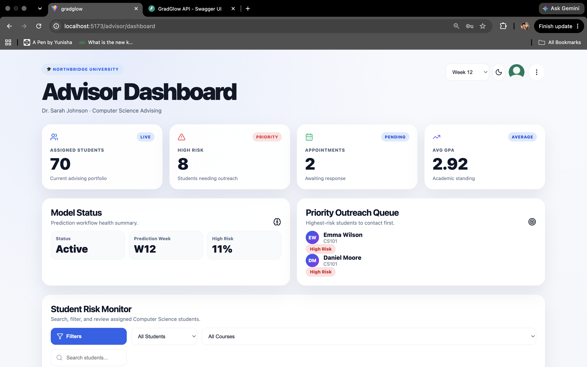
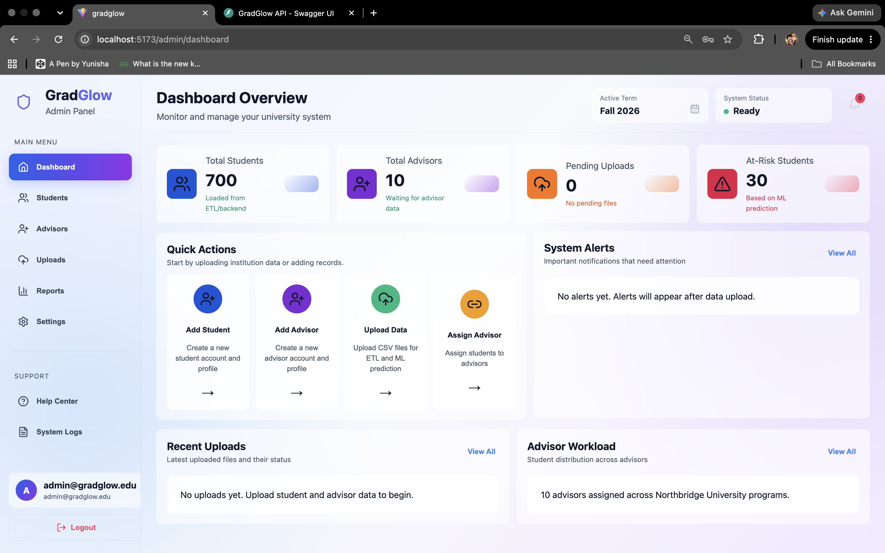
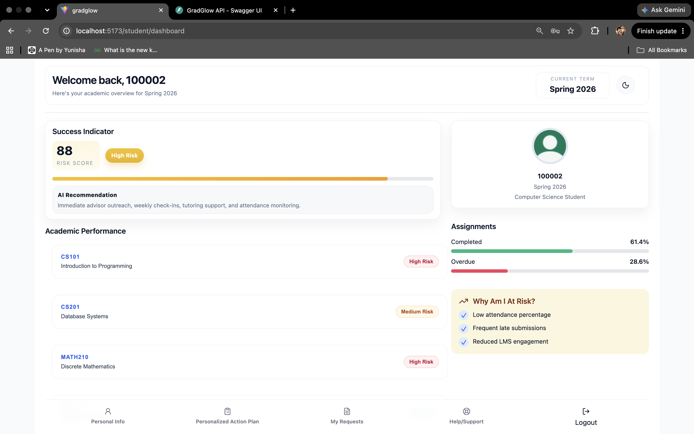

# GradGlow

**Early Student Risk Prediction & Academic Intervention Platform**

GradGlow is a full-stack machine learning application designed to identify students who may be academically at risk and provide advisors with actionable information for early intervention.

The system combines student assessment performance and Virtual Learning Environment (VLE) engagement data, processes the data through an ETL pipeline, applies checkpoint-specific machine learning models, and exposes predictions through a FastAPI backend and React frontend.

---

## Key Features

- Early student-risk prediction using machine learning
- Week 4, Week 8, and Week 12 prediction checkpoints
- Assessment and VLE engagement feature engineering
- Automated ETL pipeline for uploaded student data
- Low, Medium, and High student-risk classification
- Risk probabilities and contributing risk factors
- Recommended academic intervention actions
- Advisor dashboard and detailed student-risk views
- Student dashboard and support workflows
- Student support requests, messages, and appointments
- Role-based authentication
- Administrative student and user management
- REST API built with FastAPI
- Interactive Swagger/OpenAPI documentation

---

## Machine Learning Pipeline

GradGlow transforms raw educational data into features representing student academic performance and learning engagement.

Features include:

- Average assessment score
- Weighted assessment score
- Number of assessments submitted
- Late submission rate
- Average submission delay
- Total VLE clicks
- Active learning days
- Weeks active
- Average clicks per week
- Engagement consistency
- First-four-week VLE activity
- First-four-week assessment submissions
- Previous attempts
- Studied credits

The prediction pipeline uses checkpoint-specific trained models so that student risk can be estimated using information available at different stages of a course.

```text
Raw Educational Data
        |
        v
   ETL Pipeline
        |
        v
Feature Engineering
        |
        v
Canonical Student Dataset
        |
        v
Checkpoint Model
(Week 4 / 8 / 12)
        |
        v
Risk Probability
        |
        v
Low / Medium / High
        |
        v
Risk Factors + Recommended Actions
```

---

## System Architecture

```text
+----------------------+
|    React Frontend    |
| Student / Advisor UI |
+----------+-----------+
           |
           | REST API
           v
+----------------------+
|    FastAPI Backend   |
| Auth / API / Services|
+----------+-----------+
           |
     +-----+------+
     |            |
     v            v
+---------+   +-------------+
| SQLite  |   | ML Pipeline |
|Database |   | scikit-learn|
+---------+   +------+------+
                    |
                    v
              +-----------+
              | ETL / Data|
              | Processing|
              +-----------+
```

---

## Application Screenshots

### Advisor Dashboard



### Admin Dashboard



### Student Dashboard



---

## Technology Stack

### Frontend

- React
- Vite
- JavaScript
- CSS

### Backend

- Python
- FastAPI
- SQLAlchemy
- Pydantic
- JWT authentication

### Machine Learning & Data

- scikit-learn
- pandas
- NumPy
- joblib

### Database

- SQLite

### Development

- Git
- GitHub
- Uvicorn

---

## Dataset

GradGlow's machine learning pipeline is designed around educational assessment, enrollment, and Virtual Learning Environment interaction data.

The ETL pipeline combines student information with assessment activity and VLE engagement data to create a canonical student-level dataset for machine learning inference.

Large raw datasets, uploaded files, generated ETL outputs, local databases, and oversized model artifacts are intentionally excluded from this repository.

This keeps the repository lightweight and prevents runtime or local data from being committed to source control.

---

## Running the Project

### 1. Clone the repository

```bash
git clone https://github.com/YunishaBasnet/GradGlow.git
cd GradGlow
```

### 2. Create a Python virtual environment

```bash
python3 -m venv backend/.venv
source backend/.venv/bin/activate
```

### 3. Install backend dependencies

```bash
pip install -r backend/requirements.txt
```

### 4. Configure environment variables

Copy the example environment file:

```bash
cp .env.example .env
```

Replace the placeholder JWT secret in `.env` with a secure random value of at least 32 characters.

For example:

```bash
python -c 'import secrets; print(secrets.token_urlsafe(48))'
```

Then place the generated value in `.env`:

```text
JWT_SECRET_KEY=your-generated-secret
```

The `.env` file is intentionally excluded from Git.

### 5. Start the backend

From the project root:

```bash
uvicorn backend.app:app --reload
```

The API will run at:

```text
http://127.0.0.1:8000
```

Interactive API documentation:

```text
http://127.0.0.1:8000/docs
```

Health check:

```text
http://127.0.0.1:8000/api/health
```

### 6. Start the frontend

Open another terminal:

```bash
cd frontend
npm install
npm run dev
```

The frontend normally runs at:

```text
http://localhost:5173
```

---

## Demo Access

After running GradGlow locally, the student interface can be explored using the following demo account.


| Role | Username | Password |
|---|---|---|
| Student | `student01` | `123456` |
| Advisor | `advisor1@gradglow.edu` | `123456` |
| Admin | `admin@gradglow.edu` | `123456` |

> Demo credentials are for local testing only. Secrets and private configuration are not included in the repository.
---

## API Overview

Major API areas include:

```text
/api/auth
/api/uploads
/api/predictions
/api/student
/api/advisor
/api/admin
/api/health
```

### Authentication

```text
POST /api/auth/login
```

### Prediction Status

```text
GET /api/predictions/status
```

### Generate Predictions

```text
POST /api/predictions/generate
```

### Advisor Student Overview

```text
GET /api/advisor/students
```

### Advisor Student Detail

```text
GET /api/advisor/students/{student_id}
```

### Student Dashboard

```text
GET /api/student/{student_id}/dashboard
```

### Student Requests

```text
GET  /api/student/{student_id}/requests
POST /api/student/{student_id}/requests
```

### Student Messages

```text
GET /api/student/{student_id}/messages
```

### Student Appointments

```text
GET /api/student/{student_id}/appointments
```

---

## Example Prediction Output

A GradGlow prediction can contain information such as:

```json
{
  "student_id": "30268",
  "course_key": "AAA-2013J",
  "checkpoint_week": 4,
  "risk_probability": 0.9415,
  "risk_label": "High",
  "top_factors": [
    "No assessments submitted",
    "Low weighted assessment score",
    "Low LMS engagement"
  ],
  "recommended_actions": [
    "Schedule advisor meeting as soon as possible",
    "Encourage student to access weekly learning materials",
    "Recommend academic tutoring or review sessions"
  ],
  "model_source": "AAA/2013J",
  "model_week": "week4"
}
```

---

## Validation

GradGlow has been tested across the core application workflow, including:

- Backend compilation and route imports
- ETL generation of the canonical student dataset
- Assessment feature generation
- VLE engagement feature generation
- Checkpoint-specific machine learning prediction
- Prediction persistence
- Advisor student listing
- Advisor student detail and risk history
- JWT-protected student endpoints
- Student support requests
- Student messages and appointments
- API health endpoint
- Prediction readiness endpoint

---

## Project Structure

```text
GradGlow/
├── backend/
│   ├── etl/
│   ├── ml/
│   ├── models/
│   ├── routes/
│   ├── schemas/
│   ├── services/
│   ├── app.py
│   ├── config.py
│   └── database.py
│
├── frontend/
│   └── src/
│
├── models/
├── .env.example
├── .gitignore
└── README.md
```

---

## Security

Sensitive and runtime-specific files are excluded from Git source control, including:

- `.env`
- Local SQLite databases
- Uploaded datasets
- Generated ETL outputs
- Python virtual environments
- Frontend dependency directories
- Runtime caches
- Oversized model artifacts

JWT signing secrets are supplied through environment configuration rather than committed credentials.

The credentials shown in the Demo Access section are intended only for demonstration data and should not be reused in production environments.

---

## Future Improvements

Potential extensions include:

- Cloud deployment
- PostgreSQL production database
- Restricted online demonstration environment
- Automated model retraining
- Additional model evaluation dashboards
- Email or notification-based advisor alerts
- Expanded intervention tracking
- Longitudinal student-risk visualization
- Automated testing and CI/CD

---

## Author

**Yunisha Basnet**

GitHub: https://github.com/YunishaBasnet

---

## Disclaimer

GradGlow is an academic decision-support project.

Risk predictions should support, rather than replace, human academic advising and professional judgment.
